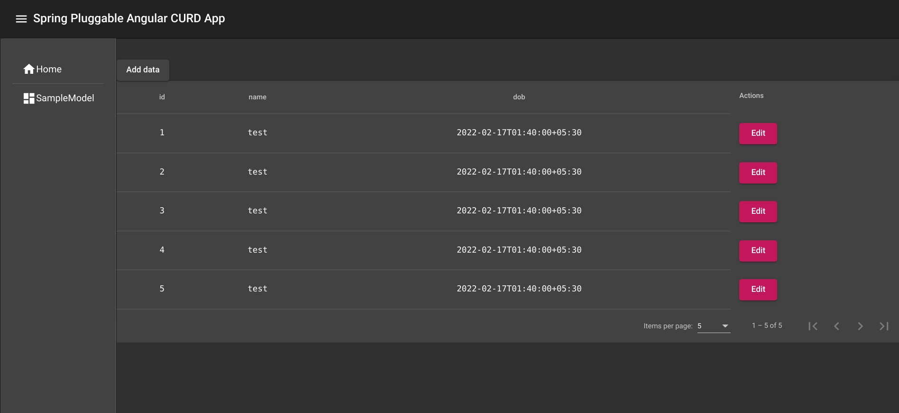

# SpringBoot Pluggable Angular CRUD UI


# 


###  1. Add Maven Dependency

```xml
<dependency>
  <groupId>com.bhawnesh.angular</groupId>
  <artifactId>spring-angular-curd</artifactId>
  <version>0.0.1-SNAPSHOT</version>
</dependency>
```
### 2. start application in 8080 port

### 3. go to  http://localhost:8080/ui/